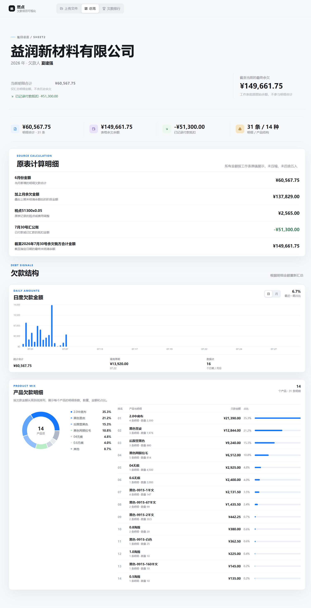
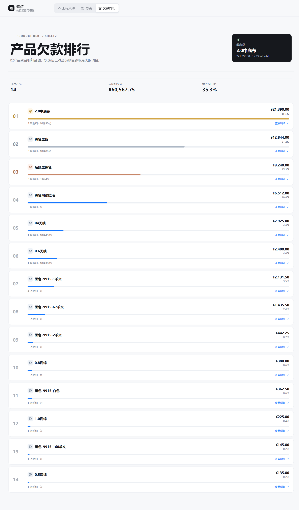

# 燃点欠款项目可视化

一个浏览器端的 Excel 欠款分析工具。它读取欠款工作簿，将每个有效 Sheet 转成可切换账单，并提供总览、趋势、产品构成、明细账本和产品欠款排行。

## 快速开始

环境要求：Node.js 18+，推荐使用 pnpm。

```powershell
pnpm install
pnpm dev
```

打开终端输出的本地地址，通常是 `http://127.0.0.1:4173/`。生产构建：

```powershell
pnpm test
pnpm build
pnpm preview
```

## 更新效果

- 新增“上传文件”独立页面，并置于顶部导航第一位。
- 支持一次选择父文件夹，自动读取人名子文件夹中的所有 Excel/CSV 表格。
- 文件卡片按“人名 → 公司名 → 原始文件名”三级排序。
- 同一人名、同一公司名下的不同原始文件保持相邻，但不会合并；同一原始文件内的多个 Sheet 仍在弹框中集中展示。
- 表格操作支持“在 Excel 中打开”和“打开总览”两个入口。
- “清除导入”只移除本次上传内容，内置账单继续保留。
- 重复导入会按账单内容指纹跳过相同 Sheet，并实时显示新增数量、重复数量和空表数量。
- 打开上传账单总览后，左上角可以返回上传文件页面。

## 使用方式

### 1. 启动项目

环境要求：Node.js 18+，推荐使用 pnpm。

```powershell
pnpm install
pnpm dev -- --host 127.0.0.1 --port 5174
```

打开终端输出的本地地址，当前使用 `http://localhost:5174/`。验证和生产构建：

```powershell
pnpm test
pnpm build
pnpm preview
```

### 2. 导入父文件夹

1. 进入“上传文件”页面。
2. 点击“导入文件夹”。
3. 选择包含人名子文件夹的父文件夹，例如 `C:\Users\Mr.shen\Desktop\欠款整理`。
4. 程序会递归读取 `.xlsx`、`.xls`、`.xlsm` 和 `.csv` 文件，并以每个表格的直接上级文件夹作为人名归类。
5. 点击文件卡片查看该原始文件中的 Sheet，再点击 Sheet 查看操作选项。

### 3. 打开原始表格或总览

- 点击“在 Excel 中打开”：开发服务器先将浏览器中的原始文件临时保存到 Windows 临时目录，再通过系统默认文件关联启动 Excel 或 WPS。
- 点击“打开总览”：查看当前账单的金额指标、原表计算、日度欠款、产品构成和明细。
- 从总览返回时，点击左上角“返回上传文件”。

### 4. 管理导入内容

- 再次导入同一文件时，相同内容的 Sheet 会自动跳过。
- 点击“清除导入”会清除本次导入的所有账单，不会删除内置账表。
- 刷新页面会清空当前浏览器会话中的临时导入内容，并重新加载内置账表。

## 注意事项

1. **文件夹选择权限**：必须点击“导入文件夹”后选择父文件夹；直接点击“导入表格”只能选择文件，无法读取整个目录结构。
2. **人名和公司名**：人名优先取表格文件的直接上级文件夹；公司名优先取表格中的 `供货商` 字段。字段识别不到时会显示“未标注”。
3. **文件不合并**：两个文件即使人名和公司名相同，也会分别保留。只有同一个原始文件中的多个 Sheet 会放在同一个文件卡片里。
4. **重复导入规则**：同一 Sheet 的内容指纹完全相同时会跳过；文件名不同但内容不同的副本不会被误合并。
5. **Excel/WPS 打开条件**：本机默认文件关联打开需要保持 `pnpm dev` 开发服务器运行。若服务不可用，程序会下载原始文件，不会修改原始表格。
6. **数据解析范围**：当前解析器按 A-F 列识别日期、产品、单位、数量、单价和欠款金额；空日期会继承上一条有效日期，空 Sheet 会被忽略。
7. **数据保存范围**：当前上传账单保存在浏览器内存中，刷新页面或关闭页面后需要重新导入；项目内置账表不受影响。

## 各板块预览

### 上传文件

展示当前账单、导入状态、导入文件夹、导入表格、清除导入和按人名/公司/原始文件排序的文件卡片。


### 文件夹与表格弹框

点击文件卡片后查看其中的 Sheet；同一原始文件的多个 Sheet 会在这里列出，并显示年份、欠款人、明细数量、产品数量和金额。


### 表格操作

点击具体 Sheet 后出现两个操作：使用本机 Excel/WPS 打开原始文件，或进入账单总览。


### 总览

总览页面包含当前明细合计、最终余欠、付款抵扣、原表计算明细、日度欠款金额柱状图、产品欠款构成和明细表。



### 欠款排行

欠款排行页面按产品展示欠款金额、占比、数量和明细，点击排行项可以展开对应明细。



## Excel 数据规则

解析器兼容 PRD 约定格式，也兼容当前实际工作簿的行位置差异：

- 供应商名称：识别包含 `供货商` 的单元格。
- 欠款人：识别包含 `客户欠款` 的单元格。
- 年份：优先识别前 16 行内的独立年份单元格。
- 明细列：日期、产品名称、单位、数量、单价、欠款金额，对应 A-F 列。
- 空日期：继承上一条有效日期，保证同一批明细可以按日/月统计。
- 汇总行：识别 `月份金额`、`合计金额`、`余欠`、`付款`、`汇公账`、`税点` 等关键词，不计入当前明细合计。

页面中的“明细合计”只累加明细行的欠款金额；“原表计算明细”逐行展示 Excel 底部的原始汇总，包括月金额、上期余欠、税点、付款抵扣和最终余欠。最终余欠不会被重复加进明细合计，金额按原始小数精度展示。

## 构成逻辑

```text
Excel 文件 / 内置资产 / 用户多文件上传
                  |
                  v
       SheetJS workbook parser
                  |
                  v
    DebtLedger[]: 元数据、明细、汇总、余额
                  |
        +---------+---------+
        |                   |
        v                   v
  analytics.ts        React views
  总额/趋势/排行       总览 / 排行 / 表格
```

核心数据流：

1. `src/lib/workbook.ts` 读取工作簿，识别有效 Sheet 并生成统一的 `DebtLedger`。
2. `src/lib/analytics.ts` 从明细行派生总额、日/月趋势、产品聚合、排行和月份分组。
3. `src/App.tsx` 管理账单列表、当前账单、视图切换、默认账表加载和多文件上传。
4. `src/components/OverviewView.tsx` 展示总览指标、原表计算明细、趋势图、产品环图和 Accordion 明细表。
5. `src/components/LeaderboardView.tsx` 展示产品欠款排行，点击排行项展开对应明细。

## 目录结构

```text
src/
  assets/                 内置 Excel 工作簿
  components/             导航、总览、图表、账表、排行组件
  lib/
    workbook.ts           Excel 读取与规范化
    analytics.ts          统计与派生数据
    format.ts             金额、日期、百分比格式化
  App.tsx                 页面状态与数据流
  styles.css              响应式视觉系统
```

## 技术栈

- React + TypeScript + Vite
- SheetJS `xlsx`：浏览器端 Excel 解析
- Recharts：趋势图与产品环图
- Framer Motion：页面、数字和展开动画
- Lucide React：界面图标
- Vitest：解析、聚合和金额精度回归测试
